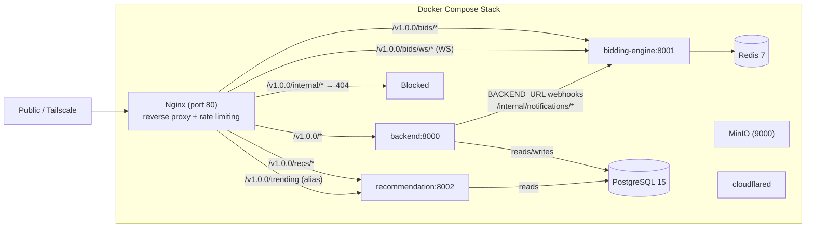

# Online Auction Platform — Project Overview & Technical Reference

> [!info] Document purpose
> Comprehensive technical documentation for the FYP Online Auction Platform (C2C microservices auction system). Written as a pre-presentation reference covering architecture, service integrations, endpoints, data model, key algorithms, and testing.

---

## Table of Contents

1. [Project Overview](#1-project-overview)
2. [System Architecture](#2-system-architecture)
3. [Core Backend — API Gateway (port 8000)](#3-core-backend--api-gateway-port-8000)
4. [Bidding Engine (port 8001)](#4-bidding-engine-port-8001)
5. [Recommendation Engine (port 8002)](#5-recommendation-engine-port-8002)
6. [Frontend (React 19)](#6-frontend-react-19)
7. [Infrastructure & DevOps](#7-infrastructure--devops)
8. [Testing & QA](#8-testing--qa)

---

## 1. Project Overview

An online **consumer-to-consumer (C2C) auction platform** where users list items, place time-based bids, track watched auctions, and transact through an internal wallet.

It is built as a **distributed microservices system** with three FastAPI services, an event-driven real-time bidding stream, and a machine-learning recommendation pipeline — all fronted by a React SPA.

### Core differentiators
- **Real-time bidding** over WebSockets with anti-snipe time extension and distributed-lock concurrency control.
- **Internal wallet escrow** — bids are money-held (escrow), not just tracked; refunds flow automatically on outbid/reserve-not-met/settlement.
- **ML-powered trending/personalized discovery** with a cache-first pandas/scikit-learn pipeline.
- **Admin moderation suite** — listing approval, keyword-based content filtering, disputes, budgets-free tier usage metering, cross-service log viewing, and a Puck CMS-driven landing page.

### Tech stack (summary)

| Layer | Technology |
|---|---|
| Backend services | FastAPI, Pydantic v2, SQLAlchemy 2 (async), Python 3.11 |
| Real-time | WebSockets, Redis (locks, caching, rate limiting) |
| Database | PostgreSQL 15 (shared across services) |
| Cache / pub-sub | Redis 7 |
| Object storage | MinIO (S3-compatible) |
| ML | pandas, scikit-learn, scikit-surprise |
| Frontend | React 19, TypeScript, Vite, Tailwind v4, TanStack Query, Axios, React Router 7 |
| CMS | Puck (visual page editor) |
| Infra | Docker Compose, Nginx reverse proxy, Cloudflare Tunnel |

---

## 2. System Architecture

### 2.1 High-level topology



### 2.2 Services & port map

| Service | Port | Role | Writes DB? | Calls backend? |
|---|---|---|---|---|
| `nginx` | 80 | Reverse proxy / API gateway, rate limiting, blocks `/internal/*` | — | — |
| Core backend | 8000 | Users, listings, admin, feedback, disputes, CMS, wallet | Yes | — |
| Bidding engine | 8001 | Real-time bids, wallet escrow, settlement | Yes | Yes (notification webhooks) |
| Recommendation engine | 8002 | Trending/personalized ranking | No (read-only) | No |
| PostgreSQL | 5432 | Shared DB (127.0.0.1 only) | — | — |
| Redis | 6379 | Locks, caches, rate-limit counters (127.0.0.1 only) | — | — |
| MinIO | 9000 | S3 object storage (images/videos/avatars) | — | — |
| Cloudflared | — | Public Tunnel (optional, not required locally) | — | — |

> [!note] Published ports
> `nginx` (80) is the only port meant to be reachable outside the Tailscale network. The bidding and recommendation engines are proxied through nginx. For local dev against the Dockerized engines, their ports (8001/8002) are also published to `127.0.0.1` for direct access by the frontend.

### 2.3 Browser fan-out (how the frontend reaches the services)

The frontend creates **three independent Axios clients** (`frontend/src/api/apiClient.ts`), all with `withCredentials: true` (httpOnly-cookie session auth):

| Client | Base URL (default) | Env override | Used for |
|---|---|---|---|
| `apiClient` | `http://localhost:8000/v1.0.0` | `VITE_API_URL` | Backend REST |
| `recsClient` | `http://localhost:8002/v1.0.0` | `VITE_RECS_URL` | Recommend `/recs/trending` |
| `biddingClient` | `http://localhost:8001/v1.0.0` | `VITE_BIDDING_URL` | Bidding health ping `/bids/health` |

Bid placement itself uses a **raw WebSocket** (not Axios) from `AuctionDetailPage.tsx` to `/v1.0.0/bids/ws/<listing_id>`.

### 2.4 Service-to-service integration

- **Bidding engine → backend (event webhooks):** `bidding-engine/app/services/notification_client.py` POSTs to `{BACKEND_URL}/v1.0.0/internal/notifications/{outbid,auction-ended}` with header `X-Internal-Api-Key` (shared `INTERNAL_API_KEY`). These hit the backend `/internal/*` endpoints → `notification_service` → creates `notifications` rows + sends emails. **Fire-and-forget** (5s timeout, errors swallowed).
- **Shared database:** all three Python services read/write the **same PostgreSQL schema** (models are hand-synced copies).
- **Shared Redis:**
  - `lock:bid:{listing_id}` — distributed bid/settlement lock (bidding engine).
  - `ratelimit:ws:{user_id}`, `ratelimit:trending:{ip}` — rate-limit sliding windows.
  - `bidcount:free_tier:{user_id}` — free-tier per-hour bid counter (written by bidding engine, **read** by backend `/users/me/quota`).
  - `recs:global:listings`, `recs:global:interactions`, `recs:anonymous:{limit}`, `recs:user:{user_id}:signals` — recommendation caches.
- **Shared auth secret:** all three validate JWTs signed with the same `JWT_SECRET` (HS256).

### 2.5 Docker Compose topology

Deployment is fully containerized via `docker-compose.yml` (13 services):

| Service | Container name (suffix) | Purpose |
|---|---|---|
| `postgres` | `AuctionHub_PostgreSQL_DB` | Shared database |
| `redis` / `redis-init` | `AuctionHub_Redis` (+ init) | Cache, locks, counters |
| `minio` / `minio-init` | `AuctionHub_MinIO_DB` (+ init) | Object storage + bucket seeding |
| `nginx` | — | Reverse proxy + rate limiting |
| `backend` | `AuctionHub_API` | API gateway |
| `bidding-engine` | `AuctionHub_BiddingEngine_Microservice` | Bids + settlement |
| `recommendation-engine` | `AuctionHub_RecommendationEngine_Microservice` | Trending/recommendations |
| `cloudflared` | `AuctionHub_CloudflareTunnel` | Optional public tunnel |

Each service is built from its own `Dockerfile`. Environment comes from `ENV_FILE` (default `.env.local`). The schema is seeded by `docker/postgres/init.sql`.

---

## 3. Core Backend — API Gateway (port 8000)

**Entry point:** `backend/app/main.py` → `uvicorn app.main:app` on port **8000**, API version `v1.0.0`.

### 3.1 Layout

```
backend/
├── app/
│   ├── main.py                  # FastAPI app, CORS, router mount
│   ├── api/
│   │   ├── deps.py              # auth deps (JWT/cookie, roles, premium)
│   │   ├── router.py            # aggregates all v1 routers
│   │   └── v1/controller/       # 16 endpoint controllers
│   ├── core/                    # config, logger, rate_limit, redis, security,
│   │                            # storage (MinIO), text_matching
│   ├── db/                      # SQLAlchemy async engine + session
│   ├── models/auction.py        # ALL ORM models + enums (single file)
│   ├── schemas/                 # Pydantic schemas
│   ├── services/                # 19 business-logic service modules
│   └── templates/email/         # 10 Jinja2 email templates
├── tests/                       # ~20 unit test files
└── integration/                 # schema-drift check against live DB
```

### 3.2 Authentication & security

- **Hybrid JWT + httpOnly cookie:** JWT (PyJWT, HS256) has claims `{sub: user_id, exp}`. Token is read from the `Authorization: Bearer` header **or** the `access_token` httpOnly cookie. Browser clients use the cookie; API clients use Bearer. Cookie is `HttpOnly`, `Secure` when `X-Forwarded-Proto: https`, `SameSite=Lax`, `Max-Age = 15min` (default).
- **Password hashing:** bcrypt (passlib) with a SHA-256 pre-hash to support >72-byte passwords.
- **Roles:** `UserRole = user | admin`. "Seller"/"buyer" are implicit (a user who creates listings is a seller), not separate DB roles.
- **Dependencies** (`app/api/deps.py`):
  - `get_current_user` — decodes JWT, rejects suspended/deleted, lazily downgrades lapsed premium.
  - `get_admin_user` — requires admin role.
  - `get_premium_user` — requires premium tier OR admin (collector boards).
  - `get_optional_user` — returns user or `None` (for personalization on public reads).
- **Rate limiting** (`app/core/rate_limit.py`): Redis-backed sliding-window per-IP via sorted sets (`ratelimit:{prefix}:{ip}`), applied through `Depends(rate_limiter(...))`. Limits: register 300, login 300, password-reset 10, email-verification 10, create-listing 10, create-dispute 5, create-feedback 20 (per 60s). Disable with `RATE_LIMIT_ENABLED=false`. IP from `x-real-ip` then `client.host`.
- **Content moderation** (`app/core/text_matching.py`): listing title/description/brand scanned against `prohibited_keywords` using substring, leetspeak/normalized, and Damerau-Levenshtein typo matching. Violations return 400 and log a `flagged_listing_attempts` row.

### 3.3 API endpoint reference

Router mount prefixes (from `app/api/router.py`):

| Prefix | Controller | Notes |
|---|---|---|
| (none) | `health` | `GET /health` |
| `/auth` | auth | |
| `/auctions` | auctions | |
| `/testimonials` | testimonials | |
| `/disputes` | disputes | |
| `/users` | users | includes wallet/watchlist/interests/purchases under `/me/*` |
| `/subscription-tiers` | subscriptions | |
| `/issue-types` | issue_types | |
| `/boards` | boards | premium collector boards |
| (none) | marketing | `/marketing-video*` |
| `/feedback` | feedback | |
| `/admin` | admin | |
| `/internal` | internal | service-to-service callbacks |
| `/cms` | cms | page content + versioning |
| `/page-content` | page_content | public + `/admin/page-content` |

#### `/auth` (`app/api/v1/controller/auth.py`)
| Method & path | Purpose |
|---|---|
| `POST /auth/register` | Create user; auto-sends verification email (rate-limited) |
| `POST /auth/login` | JWT + httpOnly `access_token` cookie |
| `POST /auth/logout` | Clears cookie |
| `GET /auth/get_current_user` | Optional-auth self lookup |
| `POST /auth/password-reset/request` | Request reset (anti-enumeration) |
| `POST /auth/password-reset/confirm` | Confirm reset with token |
| `POST /auth/email-verification/send` | Request verification email |
| `POST /auth/email-verification/confirm` | Confirm verification token |
| `POST /auth/change-password` | Change password (authenticated) |

#### `/auctions` (`app/api/v1/controller/auctions.py`)
| Method & path | Purpose |
|---|---|
| `GET /auctions/form_metadata` | Categories/conditions/bidding types/durations for the create form |
| `GET /auctions/` | Paginated search (filters: `status`, `category_id`, `search`, `condition`, `min_price`, `max_price`); logs search interactions |
| `POST /auctions/create_listing` | Create listing (rate-limited 10/hr; keyword + free-tier quota checks) |
| `PATCH /auctions/{id}` | Update draft/pending listings |
| `POST /auctions/upload_auction_images/{id}` | Image upload (PNG/JPG/WEBP, byte-sniffed) to MinIO |
| `GET /auctions/get_user_listings` | Seller's own listings |
| `GET /auctions/get_auction/{id}` | Single listing (logs a view interaction) |
| `GET /auctions/get_auction_bids/{id}/bids` | Bid history for a listing |
| `DELETE /auctions/{id}` | Soft-delete (`removed`) if no bids |
| `POST /auctions/{id}/status` | Status transitions |

> [!important] Bidding lives elsewhere
> Placing bids is **not** here — bidding lives in the separate bidding engine over WebSockets.

#### `/users` (`app/api/v1/controller/users.py`)
| Method & path | Purpose |
|---|---|
| `POST /users/me/profile` | Update profile |
| `GET /users/me/interests`, `POST /users/me/interests` | Category interests |
| `GET /users/me/bids` | Bid history (`result`: all/won/outbid) |
| `GET /users/me/purchases` | Won auctions |
| `GET /users/me/watchlist`, `POST`, `DELETE /users/me/watchlist/{listing_id}` | Watchlist |
| `GET /users/me/wallet`, `POST /users/me/wallet/topup` | Wallet balance + top-up |
| `POST /users/me/subscription` | Premium renew/cancel (deducts wallet) |
| `GET /users/me/stats` | Seller stats (views, watchlists, sales, revenue) |
| `GET /users/me/quota` | Free-tier bid/listing meters (reads Redis counter written by bidding engine) |

#### `/admin` (`app/api/v1/controller/admin.py`) — admin only
| Group | Endpoints |
|---|---|
| Users | `GET /admin/users`, `GET /admin/users/{id}`, `PATCH /{id}/suspend`, `PATCH /{id}/unsuspend`, `DELETE /{id}` |
| Listings | `GET /admin/listings`, `GET /{id}`, `PATCH /{id}/approve`, `PATCH /{id}/remove`, `POST /{id}/restart` |
| Categories | `GET/POST /admin/categories`, `PATCH/DELETE /admin/categories/{id}` |
| Bids | `DELETE /admin/bids/{id}` (cancel + refund/restore) |
| Moderation | `GET/POST /admin/prohibited-keywords`, `DELETE /{id}`, `GET /admin/flagged-attempts` |
| Logs/stats | `GET /admin/options/{set_key}`, `GET /admin/system-logs`, `GET /admin/logs`, `GET /admin/stats` |

#### `/boards` (`app/api/v1/controller/boards.py`) — premium
| Method & path | Purpose |
|---|---|
| `GET /boards/me`, `GET /boards/user/{user_id}`, `GET /boards/{id}` | List/view boards (public/private rules) |
| `POST /boards/`, `POST /boards/{id}`, `DELETE /boards/{id}` | Board CRUD |
| `POST /boards/{id}/items`, `POST /{id}/items/reorder`, `POST /{id}/items/{item_id}`, `DELETE /{id}/items/{item_id}` | Board items (won-item collections) |

#### `/feedback`, `/disputes`, `/testimonials`
| Group | Endpoints |
|---|---|
| Feedback | Public `GET /feedback/types`, `/public`, `/listing/{id}`, `/user/{id}`; auth `GET /me/eligibility/{id}`, `/me/submitted`, `POST /feedback/` (rate-limited); admin `GET /feedback/types/all`, `/feedback/types` CRUD |
| Disputes | `GET /disputes/` (admin), `GET /disputes/me`, `POST /disputes/` (rate-limited), `POST /disputes/{id}/respond` (admin resolve) |
| Testimonials | `GET /testimonials/` (featured), `/admin`, `/me`, `POST /{id}/approve`, `POST /{id}/unfeature`, `DELETE /{id}`, `POST /testimonials/` |

#### `/marketing`, `/cms`, `/page-content`, `/subscription-tiers`, `/issue-types`, `/internal`
| Group | Endpoints |
|---|---|
| Marketing | `GET /marketing-video`, `POST /marketing-video` (admin), `GET /marketing-videos`, `POST /{id}/activate`, `DELETE /{id}` |
| CMS | `GET /cms/{slug}` (public); admin `GET/PUT /{slug}/draft`, `POST /{slug}/publish`, `GET /{slug}/versions`, `GET /versions/{version_id}`, `POST /{slug}/rollback/{version_id}` |
| Page content | Public `GET /page-content/{page}`; admin `/admin/page-content` CRUD + header/contact/order |
| Subscription tiers | `GET /subscription-tiers/` |
| Issue types | `GET/POST /issue-types/`, `PATCH/DELETE /issue-types/{id}` |
| Internal | `POST /internal/notifications/outbid`, `POST /internal/notifications/auction-ended` (guarded by `X-Internal-Api-Key`) |

### 3.4 Data model

All tables use **UUID primary keys**. Enums defined in `app/models/auction.py`: `UserRole (user/admin)`, `UserStatus (active/suspended/deleted)`, `ListingStatus (draft/pending_review/active/ended/removed)`, `BiddingType (price_up/low_start/public)`, `ItemConditions (new/used/refurbished)`, `BidStatus (accepted/rejected/cancelled)`, `TransactionType (topup/bid_hold/bid_release/settlement)`, `DisputeStatus (open/in_review/resolved/closed)`, `InteractionAction (view/search/bid/watchlist)`, `SubscriptionTier (free/premium)`.

| Table | Key fields |
|---|---|
| `users` | id, username, email, password_hash, role, status, email_verified, subscription_tier, subscription_expires_at, balance, avatar_key, rating_avg, rating_count, timestamps |
| `subscription_tiers` | id, tier (unique), price, duration_days, description, is_active |
| `user_profiles` | id, user_id (unique FK), full_name, phone, address, city, country, dob, bio, email_alerts_enabled, marketing_emails_enabled |
| `categories` | id, name, slug (unique), is_active |
| `user_interests` | user_id FK, category_id FK |
| `listings` | seller_id FK, category_id FK, title, description, brand, condition, condition_confidence, bidding_type, starting_price, reserve_price, current_price, min_increment, status, is_draft, start_time, end_time |
| `listing_images` | listing_id FK, s3_key, sort_order, is_primary |
| `bids` | listing_id FK, bidder_id FK, amount, status, placed_at |
| `auction_results` | listing_id (unique FK), winner_id FK, winning_bid_id FK, final_price, ended_at |
| `watchlist` | user_id FK, listing_id FK, added_at |
| `wallet_transactions` | user_id FK, amount, type, reference |
| `password_reset_tokens` | token PK, user_id FK, expires_at, used_at |
| `email_verification_tokens` | token PK, user_id FK, expires_at, verified_at |
| `notifications` | user_id FK, title, message, is_read |
| `issue_types` | id, name (unique) |
| `disputes` | reporter_id FK, listing_id FK, issue_type_id FK, subject, category, description, status, resolved_by, resolution_note, resolved_at |
| `testimonials` | user_id FK, content, rating, is_featured |
| `admin_logs` | admin_id FK, action, target_id, details |
| `user_interactions` | user_id FK, listing_id FK, action, occurred_at |
| `collector_boards` | user_id FK, name, description, is_public |
| `board_items` | board_id FK, auction_result_id FK, note, sort_order |
| `auction_durations` | id, value (unique), label, is_active, sort_order |
| `option_sets` | set_key, value, label, sort_order, is_active |
| `feedback_types` | name (unique), reviewer_role (buyer/seller), is_active |
| `item_feedback` | listing_id FK, reviewer_id FK, reviewee_id FK, feedback_type_id FK, rating, comment, is_public |
| `prohibited_keywords` | keyword, category (default `illegal_item`), added_by |
| `flagged_listing_attempts` | user_id FK, keyword_matched, field, attempted_text |
| `marketing_videos` | s3_key (unique), original_filename, content_type, is_active (exactly one active) |
| `site_content` | slug (unique), content (JSONB), draft_content (JSONB), updated_by |
| `site_content_versions` | slug, content (JSONB), note, created_by (append-only) |

### 3.5 Service layer (`app/services/`)

| Service | Responsibilities |
|---|---|
| `auth_service` | register_user, authenticate_user, change_password |
| `password_reset_service` | request/confirm reset (token TTL 1h) |
| `email_verification_service` | send/confirm verification (TTL 24h) |
| `email_service` | FastAPI-Mail wrapper; 10 transactional email types (outbid, won, sold, suspended, deleted…) |
| `auction_service` | Listing CRUD, search, image upload, keyword scanning, free-tier listing quota (\(FREE_LISTING_HOURLY_LIMIT = 5\)), form metadata |
| `user_service` | bids, purchases, watchlist, wallet, profile, interests, subscription, seller stats, quota (\(FREE_BID_HOURLY_LIMIT = 10\)) |
| `admin_service` | moderation, categories, bid cancel, keywords, flagged attempts, logs, stats/revenue |
| `board_service` | Collector board + item CRUD, reorder |
| `feedback_service` | eligibility, submit, feedback types |
| `dispute_service` | create, list, resolve disputes |
| `issue_type_service` | issue type CRUD |
| `interaction_service` | log_interaction / log_search_interactions (background tasks) |
| `notification_service` | push notifications + emails (called via internal endpoints) |
| `marketing_service` | marketing video library |
| `cms_service` | site content publish/draft/versions/rollback |
| `page_content_service` | policies page sections |
| `subscription_service` | list active tiers |
| `testimonial_service` | testimonials CRUD + feature/approve |

---

## 4. Bidding Engine (port 8001)

A **write-heavy, consistency-critical** service handling real-time bid placement, wallet escrow, and auction settlement.

### 4.1 Layout
```
bidding-engine/
├── app/
│   ├── main.py                    # FastAPI bootstrap, CORS, router
│   ├── api/v1/controller/bids.py  # REST health + WS /ws/{listing_id}
│   ├── core/
│   │   ├── config.py              # pydantic settings
│   │   ├── connection_manager.py  # WS ConnectionManager + rate limiter
│   │   ├── redis.py               # async redis (Upstash/TLS aware)
│   │   └── scheduler.py           # APScheduler (60s settlement)
│   ├── db/                        # async engine + session
│   ├── models/auction.py          # read/write ORM models
│   └── services/
│       ├── bidding_service.py     # BiddingService (core bid logic)
│       ├── notification_client.py # webhooks → backend /internal/*
│       └── settlement_service.py  # auction settlement
└── tests/ + integration/
```

### 4.2 Endpoints & WebSocket protocol

**REST**
| Method & path | Purpose |
|---|---|
| `GET /` | `{"message":"Bidding Engine Active"}` |
| `GET /v1.0.0/bids/health` | Health check |
| `GET /v1.0.0/bids/docs` | Swagger UI |
| `GET /v1.0.0/bids/openapi.json` | OpenAPI schema |

**WebSocket** — `WS /v1.0.0/bids/ws/{listing_id}?token=<JWT>`
- Auth: JWT via `?token=` query param OR `access_token` cookie (browsers can't set headers). Failure → close `1008`.
- **Client→server frame:**
  ```json
  { "type": "place_bid", "amount": 150.0 }
  ```
- **Server→client broadcast (`new_bid`):**
  ```json
  { "type": "new_bid", "listing_id": "...", "current_price": 150.0, "bidder_id": "...",
    "bidder_username": "bob", "amount": 150.0, "timestamp": "...", "end_time": "...", "time_extended": false }
  ```
- **Server→client broadcast (`auction_ended`):**
  ```json
  { "type": "auction_ended", "listing_id": "...", "outcome": "sold|reserve_not_met|no_bids",
    "winner_id": "..."|null, "final_price": 0.0, "ended_at": "..." }
  ```
- **Server→client (`error`):** sent only to the sender of a failed bid.

### 4.3 Bid lifecycle (`bidding_service.process_bid_message` → `_execute_bid`)

1. **Validate** frame (`type == "place_bid"`, `amount > 0`).
2. **Acquire distributed Redis lock** `lock:bid:{listing_id}` (timeout 5s, blocking 3s). Failure → retryable error.
3. **Validate listing** — exists, `status == active`, `end_time` in future, bidder ≠ seller.
4. **Compute minimum required bid:**
   - `public` → `current_price + 1.0` (fixed $1 increment)
   - `low_start` with no bids → `starting_price`
   - otherwise → `max(current_price + min_increment, starting_price)`
5. **Row-lock user** (`SELECT ... FOR UPDATE` on `users`), re-check status and `balance >= amount`.
6. **Free-tier limit:** atomic Redis counter `bidcount:free_tier:{user_id}` (INCR/EXPIRE 3600), max `FREE_BID_HOURLY_LIMIT = 10`. Rejected attempts DECR to refund their quota slot.
7. **Release previous highest bidder's hold** if one exists (credit balance + `bid_release` wallet transaction).
8. **Debit bidder**, create `Bid(status=accepted)`, `bid_hold` wallet transaction, update `listing.current_price`.
9. **Anti-snipe:** if ≤ 60s remaining (`ANTI_SNIPE_WINDOW_SECONDS`), extend `end_time` by 60s (`ANTI_SNIPE_EXTENSION_SECONDS`).
10. **Log interaction** `UserInteraction(action=bid)`, commit atomically.
11. **Fire webhook** `notification_client.notify_outbid()` (fire-and-forget).
12. Return `new_bid` payload (with `time_extended` flag).

### 4.4 Settlement algorithm (`settlement_service`)

- **Scheduler:** `AsyncIOScheduler` ticks every 60s (`max_instances=1`).
- **`settle_ended_auctions(db)`:** finds `status == active AND end_time <= now`; settles each.
- **`_execute_settlement`** (idempotent — skips if `AuctionResult` exists):
  - Re-acquires `lock:bid:{listing_id}` (10s/2s) to serialize with last-second bids.
  - **No winning bid** → `AuctionResult(winner_id=None, outcome=no_bids, final_price=starting_price)`.
  - **Reserve not met** → refund winner's hold (`bid_release`), `AuctionResult(winner_id=None, outcome=reserve_not_met)`.
  - **Reserve met / no reserve** → credit seller (`settlement` transaction), `AuctionResult(winner_id, outcome=sold)`.
  - Sets `listing.status = ended`, commits, broadcasts `auction_ended` to WS subscribers, fires `notify_auction_ended()` webhook.

### 4.5 Concurrency & Redis usage
- `lock:bid:{listing_id}` — serializes bids + settlement on the same listing.
- `SELECT ... FOR UPDATE` on `users.balance` — prevents lost updates across different listings (listing-lock alone is insufficient).
- `ratelimit:ws:{user_id}` — WS sliding window (10 msgs / 5s), fails open if Redis down.
- Wallet escrow model (hold → release/settlement) prevents double-spending.

---

## 5. Recommendation Engine (port 8002)

A **read-only, cache-first** trending/personalization service. Never writes to the DB.

### 5.1 Layout
```
recommendation-engine/
├── app/
│   ├── main.py                    # FastAPI bootstrap
│   ├── api/v1/endpoints/recommendations.py  # /trending + /health
│   ├── api/deps.py                # get_optional_user_id (JWT)
│   ├── core/                      # config, logger, rate_limit, redis
│   ├── db/ + models/auction.py    # read-only models (hand-synced)
│   ├── schemas/recommendations.py # TrendingResponse / TrendingListing
│   └── services/
│       ├── cache_service.py       # Redis DataFrame/JSON cache helpers
│       ├── location.py            # address → (city, region)
│       ├── recommendation_service.py  # orchestration
│       └── trending.py            # pure scoring functions
└── tests/ + integration/
```

### 5.2 Endpoints
| Method & path | Purpose |
|---|---|
| `GET /` | `{"message":"Recommendation Engine Active"}` |
| `GET /v1.0.0/recs/health` | Health check |
| `GET /v1.0.0/recs/trending?limit=20` | Trending (optional auth; rate-limited 30 req/min/IP) |
| `GET /v1.0.0/recs/docs` | Swagger UI |

**Auth:** optional `user_id` from Bearer header or `access_token` cookie. Invalid/missing → `None` (anonymous browsing never breaks).

**Response:**
```json
{ "items": [ { "...listing fields...", "score": 12.34, "images": [...], "seller": {...} } ],
  "count": 20, "type": "personalized" | "trending" }
```

### 5.3 Scoring algorithm (`trending.py`)

**Action weights:** `bid 5.0`, `watchlist 3.0`, `view 1.0`, `search 1.0`, `bid_placed 8.0`, `watchlist_active 4.0`, `purchase 10.0`, `board_curated 12.0`.

**Constants:** `TRENDING_WINDOW_DAYS = 7`, `ENDING_SOON_WINDOW_HOURS = 72`, weights `URGENCY 0.5`, `SEGMENT 0.5`, `CATEGORY 0.5`, `BRAND 0.4`, `PRICE 0.3`, `CONDITION 0.2`, `CF 0.5`.

**Composite (multiplicative) formula** — popularity drives the base; personalization modulates it:
```
score = popularity × (1 + 0.5·urgency) × (1 + 0.5·segment) × (1 + 0.5·category)
       × (1 + 0.5·cf) × (1 + 0.4·brand) × (1 + 0.3·price) × (1 + 0.2·condition)
```
Because it's multiplicative, a listing with **zero popularity scores 0** regardless of personalization.

**Signals:**
- **`popularity_scores`** — weighted interaction sum per listing.
- **`urgency_scores`** — linear ramp over the 72h window before `end_time` (clipped [0,1]); ended = 0.
- **`brand_affinity_scores`** — binary brand match vs. user's brand set.
- **`price_affinity_scores`** — `1 - |price - user_median|/(2·user_median)`, clipped [0,1]; neutral 0.5 without history.
- **`condition_quality_scores`** — AI `condition_confidence` (0–100 → 0–1), default 0.5.
- **`cf_scores`** — user-based **collaborative filtering**: user×listing interaction weight matrix → cosine similarity between the user and peers → weighted propagation of peers' listing weights, normalized to [0,1]. Zero for cold-start users.
- **`age_group`** — DOB → `under_18, 18_24, 25_34, 35_44, 45_54, 55_plus` with birthday-boundary handling.
- **`_relative_boost`** — normalizes a subset's popularity by its own max (for segment/category boosts).

### 5.4 Pipeline (`recommendation_service.get_trending`)

1. **Anonymous** → serve pre-scored Redis cache `recs:anonymous:{limit}` (TTL 5 min).
2. **Authenticated:**
   - Load active-listing snapshot + unified interaction DataFrame (both cache-first, TTL 5 min).
   - Enrich per-user signals (cached 24h): demographic segment, category affinity, brand history, price profile, collaborative filtering.
   - Run the 8-factor ranking, hydrate top-N with full ORM (eager-loaded images + seller), return `{items, count, type}`.
3. **Cache keys:** `recs:global:listings`, `recs:global:interactions`, `recs:anonymous:{limit}`, `recs:user:{user_id}:signals`.
4. **Interaction sources** (merged into one DataFrame with a synthetic `action`): `user_interactions` (7-day), `bids` → `bid_placed`, `watchlist` → `watchlist_active`; `user_profiles` outer-joined for demographics.
5. **No background workers** — recomputation is driven purely by cache TTL expiry (data ≤ 5 min stale; user signals ≤ 24h).

---

## 6. Frontend (React 19)

### 6.1 Stack
React 19, TypeScript (~6.0), Vite 8, Tailwind v4 (CSS-first), TanStack Query 5, Axios, React Router 7, Puck CMS, date-fns, lucide-react, react-datepicker. Tested with Vitest 4 + Testing Library.

### 6.2 Routing
**Public:** `/` (CMS landing via `CmsPage`), `/landing-legacy`, `/browse`, `/auction/:id`, `/register`, `/login`, `/admin-login`, `/forgot-password`, `/reset-password`, `/verify-email`, `/privacy`, `/terms`.

**Protected user** (within `DashboardLayout`):
| Route | Page |
|---|---|
| `/onboarding/interests` | ChooseInterestsPage |
| `/dashboard` | UserDashboardPage |
| `/profile` | ProfilePage |
| `/seller-dashboard` | SellerDashboardPage |
| `/create-listing`, `/edit-listing/:id` | ListingFormPage |
| `/watchlist` | WatchlistPage |
| `/wallet`, `/wallet/top-up` | WalletPage |
| `/activity` | UserActivityPage |
| `/collector-board` | CollectorBoardPage |
| `/support`, `/support/success` | SupportPage |
| `/testimonial/success` | TestimonialSuccessPage |

**Admin** (within `DashboardLayout`):
- `/admin-dashboard` → redirects to `/admin/users`
- `/admin/:section` — dynamic sections: `users`, `feedback-types`, `activity-stats`, `system-logs`, `audit-logs`, `listings`, `moderation`, `categories`, `cases`, `testimonials`, `marketing`, `privacy`, `terms`
- `/admin/cms` — full-bleed Puck editor (slug `landing`)

### 6.3 API layer & env vars
Frontend `.env`:
```
VITE_API_URL=http://localhost:8000/v1.0.0
VITE_RECS_URL=http://localhost:8002/v1.0.0
VITE_BIDDING_URL=http://localhost:8001/v1.0.0
VITE_WS_URL=ws://localhost:8001/v1.0.0/bids/ws
```
`apiClient.ts` builds three Axios clients (`apiClient`, `recsClient`, `biddingClient`). A response interceptor redirects to `/login` on 401 except for `/auth/login` and `/auth/get_current_user`.

API modules: `usersApi`, `auctionsApi`, `recommendationsApi`, `adminApi`, `authApi`, `boardsApi`, `cmsApi`, `feedbackApi`, `interestsApi`, `marketingApi`, `pageContentApi`, `supportApi`, plus `services/adminUsersApi`.

### 6.4 Auth & state
- **HttpOnly cookie session** (JS never stores tokens). `AuthContext` (`useAuth()`) hydrates via `GET /auth/get_current_user`, exposes `login/logout/register/refreshUser/adjustBalance`, and handles cross-tab logout via a `storage` listener.
- **All server state** via TanStack Query (`staleTime: 5 min`, `retry: 1`). `ProtectedRoute` guards user/admin roles.

### 6.5 Key components
`AuctionCard` (image, StatusBadge, watchlist heart, countdown, bid link), `StatusBadge` (status→color map), `CountdownBadge`/`useCountdown`, `ProtectedRoute`, `Navbar`, `Sidebar`, `AccountMenu`, `DashboardStatCard`, `DataTable`, `EmptyState`, `FilterPanel`, `SearchBar`, form components (`FormInput`, `TextAreaField`, `SelectField`, `StyledSelect`, `PrimaryButton`, `SecondaryButton`), `Modal`, `SectionHeader`, `IconTooltip`.

### 6.6 CMS (Puck)
The landing page (`/`) is fully CMS-driven. `AdminCmsPage` provides a full-bleed Puck editor with **8 components**: `Hero`, `Categories` (dynamic), `TrendingAuctions` (dynamic from recs engine), `FeatureGrid`, `TestimonialWall` (dynamic), `PricingBlock`, `ContactBlock`, `Banner`. Supports Save Draft / Publish / Preview / History (with rollback) via the CMS backend API. Uses `safeCtaLink()` to block `javascript:`/`data:` link injection.

---

## 7. Infrastructure & DevOps

### 7.1 nginx routing (`docker/nginx/default.conf`)
- `/v1.0.0/bids/ws/` → bidding engine (WS upgrade)
- `/v1.0.0/bids/` → bidding engine (rate-limited `20 r/s burst 40`)
- `/v1.0.0/auth/` → backend
- `/v1.0.0/` → backend
- `/v1.0.0/recs/` → recommendation engine
- `/v1.0.0/trending` → `recommendation_engine/v1.0.0/recs/trending` (alias)
- `/v1.0.0/internal/*` → **404** (publicly blocked)
- `/auction-assets/`, `/auction-avatars/`, `/auction-videos/` → MinIO
- `/health` → health

### 7.2 MinIO buckets
`auction-assets` (listing images), `auction-avatars` (profile avatars), `auction-videos` (marketing videos). Seeded by `docker/minio/init-buckets.sh`.

### 7.3 Redis keys inventory
| Key | Owner | Purpose |
|---|---|---|
| `lock:bid:{listing_id}` | bidding | distributed lock |
| `ratelimit:ws:{user_id}` | bidding | WS rate limit |
| `ratelimit:{prefix}:{ip}` | backend/recs | HTTP per-IP rate limit |
| `bidcount:free_tier:{user_id}` | bidding (read by backend) | free-tier bid meter |
| `recs:global:listings` | recs | listing snapshot (5 min) |
| `recs:global:interactions` | recs | interaction DF (5 min) |
| `recs:anonymous:{limit}` | recs | anonymous trending (5 min) |
| `recs:user:{user_id}:signals` | recs | user signals (24h) |

### 7.4 Useful scripts (`scripts/`)
- `apply_migrations.py` + `migrations/` — DB migrations helper
- `seed_data.py`, `seed_data_prod.py`, `seed_extra_active_listings.py` — seeding
- `deploy_auction.sh` — deployment helper

### 7.5 Key env variables (see `.env.example` / `.env.local`)
- Connections: `DATABASE_URL`, `REDIS_URL`, `BACKEND_URL`, `BIDDING_SERVICE_URL`, `RECOMMENDATION_SERVICE_URL`
- S3: `S3_ENDPOINT`, `S3_ACCESS_KEY`, `S3_SECRET_KEY`, `S3_BUCKET_*`, `S3_PUBLIC_URL`
- Auth: `JWT_SECRET`, `ALGORITHM=HS256`, `ACCESS_TOKEN_EXPIRE_MINUTES=15`, `INTERNAL_API_KEY`
- CORS: `ALLOWED_ORIGINS`
- Rate limits: `RATE_LIMIT_ENABLED`, `RATE_LIMIT_*` knobs
- Email: `MAIL_*` (SMTP, Gmail default)
- TTLs: `PASSWORD_RESET_TOKEN_TTL_HOURS=1`, `EMAIL_VERIFICATION_TOKEN_TTL_HOURS=24`
- Frontend: `VITE_API_URL`, `VITE_RECS_URL`, `VITE_BIDDING_URL`, `VITE_WS_URL`

### 7.6 Running
```bash
cp .env.example .env.local   # configure secrets
docker compose up --build    # start full stack
```
Docs pages: backend `/v1.0.0/docs`, bidding `/v1.0.0/bids/docs`, recommendation `/v1.0.0/recs/docs`, MinIO console `:9001`.

---

## 8. Testing & QA

### 8.1 Backend (pytest + pytest-asyncio)
- Framework: pytest, `asyncio_mode = auto`. Deps: pytest 8.3.4, pytest-asyncio, ruff, mypy.
- `conftest.py` sets dummy env vars, disables rate limiting, patches MinIO at import.
- **Unit tests** (`backend/tests/`, ~20 files) use `tests/fakedb.py` (fake AsyncSession via MagicMock/AsyncMock). Coverage: admin_service, auction_service, auth_service, board_service, cms_service, dispute_service, email_service, email_verification_service, feedback_service, interaction_service, issue_type_service, marketing_service, notification_service, page_content_service, password_reset_service, security, subscription_service, testimonial_service, text_matching, user_quota, user_service, admin_logs.
- **Integration** (`backend/integration/test_schema_drift.py`): runs `SELECT ... LIMIT 0` over every mapped model against the **live** DB to catch model↔schema drift (critical because the shared schema is hand-synced across the three services).

Run: `cd backend && pytest tests/` (and `pytest integration/`).

### 8.2 Bidding engine
- **Unit tests** (`tests/`): `test_bidding_service.py` (all `_execute_bid` guards + happy path + anti-snipe), `test_settlement_broadcast.py`, `test_connection_manager.py`, `test_rate_limit.py`, `test_notification_client.py`.
- **Integration** (`integration/test_bidding_integration.py`): provisioned throwaway `auction_integration_test` Postgres DB (cloned via `pg_dump`), asserts concurrent bids serialize, wallet escrow conservation across outbid/refund, and schema-match for the written tables.

### 8.3 Recommendation engine
- **Unit tests** (`tests/`): `test_trending.py` (age buckets, every scoring function, `cf_scores`, cold start, `rank_listings` end-to-end), `test_recommendation_helpers.py` (DataFrame casting), `test_cache_service.py` (fail-open cache contract), `test_cache_helpers.py`, `test_location.py`.
- **Integration** (`integration/test_schema_drift.py`): schema drift check over all read models.

### 8.4 Frontend (Vitest + Testing Library)
- Config: jsdom, setup `src/test/setup.ts` (jest-dom + cleanup), css off.
- **API tests** for every api module — assert correct client + path + params (e.g., `recommendationsApi.test.ts` mocks all three clients and verifies `recsClient.get('/recs/trending', ...)`).
- **Component tests** (22): StatusBadge, AuctionCard, CountdownBadge, DataTable, Modal, ProtectedRoute, form controls, etc.
- **Page tests**: UserDashboardPage, AuctionDetailPage (with a `MockWebSocket` verifying `place_bid` frames and inbound updates), RegisterPage, LoginPage, auth/verify/reset pages, Privacy/Terms, ListingFormPage, and admin sections.
- **CMS tests**: `CmsPage`, `puckConfig`, `VersionHistoryPanel`.
- **Context/hooks**: `AuthContext`, `useOptions`.

Run: `cd frontend && npm test`.

### 8.5 Test commands summary
```bash
# Backend
cd backend && pytest tests/ && pytest integration/

# Bidding engine
cd bidding-engine && pytest tests/ && pytest integration/

# Recommendation engine
cd recommendation-engine && pytest tests/ && pytest integration/

# Frontend
cd frontend && npm test
```

---

*End of document. Generated as a pre-presentation technical reference covering architecture, integrations, endpoints, data model, algorithms, infra, and testing.*
