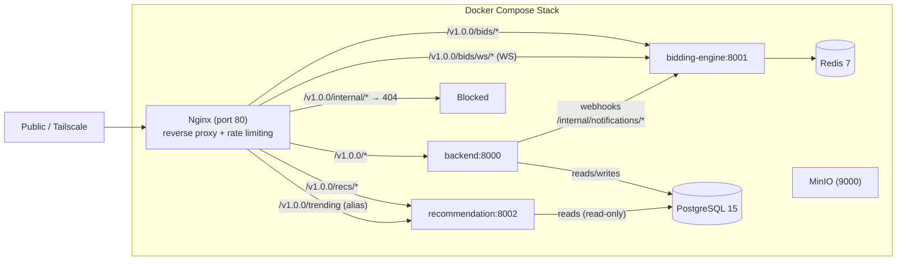

> [!info] Document purpose
> Comprehensive technical documentation for the FYP Online Auction Platform (C2C microservices auction system). Written as a pre-presentation reference covering architecture, service integrations, endpoints, data model, key algorithms, security, nginx, and testing.

---

## Table of Contents

1. [Project Overview](#1-project-overview)
2. [System Architecture](#2-system-architecture)
3. [Core Backend — API Gateway (port 8000)](#3-core-backend--api-gateway-port-8000)
4. [Bidding Engine (port 8001)](#4-bidding-engine-port-8001)
5. [Recommendation Engine (port 8002)](#5-recommendation-engine-port-8002)
6. [Frontend (React 19)](#6-frontend-react-19)
7. [Security Measures](#7-security-measures)
8. [nginx — Reverse Proxy & How It Works](#8-nginx--reverse-proxy--how-it-works)
9. [Infrastructure & DevOps](#9-infrastructure--devops)
10. [Testing & QA](#10-testing--qa)

---

## 1. Project Overview

An online **consumer-to-consumer (C2C) auction platform** where users list items, place time-based bids, track watched auctions, and transact through an internal wallet.

It is built as a **distributed microservices system** with three FastAPI services, an event-driven real-time bidding stream, and a machine-learning recommendation pipeline — all fronted by a React SPA.

### 1.1 Core differentiators

- **Real-time bidding** over WebSockets with anti-snipe time extension and distributed-lock concurrency control.
- **Internal wallet escrow** — bids are money-held (escrow), not just tracked; refunds flow automatically on outbid/reserve-not-met/settlement.
- **ML-powered trending/personalized discovery** with a cache-first pandas/scikit-learn pipeline.
- **Admin moderation suite** — listing approval, keyword-based content filtering, disputes, budget & free-tier usage metering, cross-service log viewing, and a Puck CMS-driven landing page.

### 1.2 Tech stack (summary)

| Layer | Technology |
|---|---|
| Backend services | FastAPI, Pydantic v2, SQLAlchemy 2 (async), Python 3.11 |
| Real-time | WebSockets, Redis (locks, caching, rate limiting) |
| Database | PostgreSQL 15 (shared across services) |
| Cache / pub-sub | Redis 7 |
| Object storage | MinIO (S3-compatible) |
| ML | pandas, scikit-learn, scikit-surprise |
| Frontend | React 19, TypeScript, Vite, Tailwind v4, TanStack Query, Axios, React Router 7 |
| CMS | Puck (visual page editor) |
| Infra | Docker Compose, Nginx reverse proxy, Cloudflare Tunnel |

---

## 2. System Architecture

### 2.1 High-level topology



### 2.2 Services & port map

| Service | Port | Role | Writes DB? | Calls backend? |
|---|---|---|---|---|
| `nginx` | 80 | Reverse proxy / API gateway, rate limiting, blocks `/internal/*` | — | — |
| Core backend | 8000 | Users, listings, admin, feedback, disputes, CMS, wallet | Yes | — |
| Bidding engine | 8001 | Real-time bids, wallet escrow, settlement | Yes | Yes (notification webhooks) |
| Recommendation engine | 8002 | Trending/personalized ranking | No (read-only) | No |
| PostgreSQL | 5432 | Shared DB (127.0.0.1 only) | — | — |
| Redis | 6379 | Locks, caches, rate-limit counters (127.0.0.1 only) | — | — |
| MinIO | 9000 | Object storage (images/videos/avatars) | — | — |
| Cloudflared | — | Public tunnel (optional, not required locally) | — | — |

> [!note] Published ports
> nginx (`:80`) is the **only** port intended to be reachable outside the Tailscale network. PostgreSQL, Redis, and MinIO bind to `127.0.0.1`; the backend, bidding, and recommendation services publish **no host port at all** in Docker Compose — every request reaches them only through nginx.

### 2.3 Browser fan-out (how the frontend reaches the services)

The frontend creates **three independent Axios clients** (`frontend/src/api/apiClient.ts`, all `withCredentials: true` for httpOnly-cookie sessions):

| Client | Base URL (default) | Env override | Used for |
|---|---|---|---|
| `apiClient` | `http://localhost:8000/v1.0.0` | `VITE_API_URL` | Backend REST |
| `recsClient` | `http://localhost:8002/v1.0.0` | `VITE_RECS_URL` | `/recs/trending` |
| `biddingClient` | `http://localhost:8001/v1.0.0` | `VITE_BIDDING_URL` | Bidding health ping |

Bid placement itself uses a **raw WebSocket** (not Axios) from `AuctionDetailPage.tsx` to `/v1.0.0/bids/ws/<listing_id>`.

### 2.4 Service-to-service integration

- **Bidding engine → backend (event webhooks):** `notification_client.py` POSTs to `{BACKEND_URL}/v1.0.0/internal/notifications/{outbid,auction-ended}` with the `X-Internal-Api-Key` header (shared `INTERNAL_API_KEY`). The backend turns these into `notifications` rows + transactional emails. **Fire-and-forget** (5s timeout, errors swallowed so notification failure can never roll back a bid/settlement).
- **Shared database:** all three services read/write the **same PostgreSQL schema** (models are hand-synced copies).
- **Shared Redis:** distributed locks, WS/HTTP rate-limit windows, the free-tier bid counter, and recommendation caches (see [§ 9.3 Redis key inventory](#93-redis-keys-inventory)).
- **Shared auth secret:** all three services validate JWTs signed with the same `JWT_SECRET` (HS256).

### 2.5 Docker Compose topology

Deployment is fully containerized via `docker-compose.yml`. Each service is built from its own `Dockerfile`; env comes from `ENV_FILE` (default `.env.local`); the schema is seeded by `docker/postgres/init.sql`.

| Container | Purpose |
|---|---|
| `AuctionHub_PostgreSQL_DB` | Shared database |
| `AuctionHub_Redis` (+ init) | Cache, locks, counters |
| `AuctionHub_MinIO_DB` (+ init) | Object storage + bucket seeding |
| nginx | Reverse proxy + rate limiting |
| `AuctionHub_API` | API gateway (backend) |
| `AuctionHub_BiddingEngine_Microservice` | Real-time bids + settlement |
| `AuctionHub_RecommendationEngine_Microservice` | Trending / recommendations |
| `AuctionHub_CloudflareTunnel` | Optional public tunnel |

---

## 3. Core Backend — API Gateway (port 8000)

**Entry point:** `backend/app/main.py` → `uvicorn app.main:app` on port **8000**. API version `v1.0.0`.

### 3.1 Layout

```
backend/
├── app/
│   ├── main.py                 # FastAPI app, CORS, router mount
│   ├── api/
│   │   ├── deps.py             # auth deps (JWT/cookie, roles, premium)
│   │   ├── router.py           # aggregates all v1 routers
│   │   └── v1/controller/      # endpoint controllers
│   ├── core/                   # config, logger, rate_limit, redis, security,
│   │                           # storage (MinIO), text_matching
│   ├── db/                     # SQLAlchemy async engine + session
│   ├── models/auction.py       # ALL ORM models + enums (single file)
│   ├── schemas/                # Pydantic schemas
│   ├── services/               # business-logic service modules
│   └── templates/email/        # Jinja2 email templates
├── tests/                      # unit test files
└── integration/                # schema-drift check against live DB
```

### 3.2 Authentication

- **Hybrid JWT + httpOnly cookie:** JWT (PyJWT, HS256) with claims `{sub: user_id, exp}`. The token is read from `Authorization: Bearer` **or** the `access_token` httpOnly cookie — browsers use the cookie, API clients use Bearer.
- **Cookie attributes:** HttpOnly, `Secure` when `X-Forwarded-Proto: https`, `SameSite=Lax`, `Max-Age = 15 min` (default).
- **Roles:** `UserRole = user | admin`. “Seller”/“buyer” are implicit (creating a listing makes you a seller), not separate DB roles.
- **Dependencies** (`app/api/deps.py`):
  - `get_current_user` — decodes JWT, rejects suspended/deleted users, lazily downgrades expired premium.
  - `get_admin_user` — requires admin role.
  - `get_premium_user` — requires premium tier OR admin (collector boards).
  - `get_optional_user` — returns the user or `None` for personalization on public reads.

### 3.3 Endpoint reference

Router mount prefixes (from `app/api/router.py`):

| Prefix | Controller | Notes |
|---|---|---|
| (none) | health | `GET /health` |
| `/auth` | auth | |
| `/auctions` | auctions | |
| `/testimonials` | testimonials | |
| `/disputes` | disputes | |
| `/users` | users | wallet/watchlist/interests/purchases/payments under `/me/*` |
| `/subscription-tiers` | subscriptions | |
| `/issue-types` | issue_types | |
| `/boards` | boards | premium collector boards |
| (none) | marketing | `/marketing-video*` |
| `/feedback` | feedback | |
| `/admin` | admin | |
| `/internal` | internal | service-to-service callbacks |
| `/cms` | cms | page content + versioning |
| `/page-content` | page_content | public + `/admin/page-content` |

#### `/auth`
| Method & path | Purpose |
|---|---|
| `POST /auth/register` | Create user; auto-sends verification email (rate-limited) |
| `POST /auth/login` | JWT + httpOnly `access_token` cookie |
| `POST /auth/logout` | Clears cookie |
| `GET /auth/get_current_user` | Optional-auth self lookup |
| `POST /auth/password-reset/request` | Request reset (anti-enumeration) |
| `POST /auth/password-reset/confirm` | Confirm reset with token |
| `POST /auth/email-verification/send` | Send verification email |
| `POST /auth/email-verification/confirm` | Confirm verification token |
| `POST /auth/change-password` | Change password (authenticated) |

#### `/auctions`
| Method & path | Purpose |
|---|---|
| `GET /auctions/form_metadata` | Categories/conditions/bidding types/durations for the create form |
| `GET /auctions/` | Paginated search (filters); logs search interactions |
| `POST /auctions/create_listing` | Create listing (rate-limited, keyword + free-tier quota checks) |
| `PATCH /auctions/{id}` | Update draft/pending listings |
| `POST /auctions/upload_auction_images/{id}` | Image upload (PNG/JPG/WEBP, byte-sniffed) to MinIO |
| `GET /auctions/get_user_listings` | Seller's own listings |
| `GET /auctions/get_auction/{id}` | Single listing (logs a view interaction) |
| `GET /auctions/get_auction_bids/{id}/bids` | Bid history |
| `DELETE /auctions/{id}` | Soft-delete (`removed`) if no bids |
| `POST /auctions/{id}/status` | Status transactions |

> [!important] Bidding lives elsewhere
> Placing bids is **not** here — bidding lives in the separate bidding engine over WebSockets.

#### `/users`
| Method & path | Purpose |
|---|---|
| `POST /users/me/profile` | Update profile |
| `GET /users/me/interests`, `POST /users/me/interests` | Category interests |
| `GET /users/me/bids` | Bid history (`result`: all/won/outbid) |
| `GET /users/me/purchases` | Won auctions |
| `GET /users/me/watchlist`, `POST`, `DELETE /users/me/watchlist/{listing_id}` | Watchlist |
| `GET /users/me/wallet`, `POST /users/me/wallet/topup` | Wallet balance + top-up |
| `POST /users/me/subscription` | Premium renew/cancel (deducts wallet) |
| `GET /users/me/stats` | Seller stats (views, watchlists, sales, revenue) |
| `GET /users/me/quota` | Free-tier bid/listing meters (reads Redis counters written by the bidding engine) |

#### `/admin` — admin only
| Group | Endpoints |
|---|---|
| Users | `GET /admin/users`, `GET /admin/users/{id}`, `PATCH /{id}/suspend`, `PATCH /{id}/unsuspend`, `DELETE /{id}` |
| Listings | `GET /admin/listings`, `GET /{id}`, `PATCH /{id}/approve`, `PATCH /{id}/remove`, `POST /{id}/restart` |
| Categories | `GET/POST /admin/categories`, `PATCH/DELETE /admin/categories/{id}` |
| Bids | `DELETE /admin/bids/{id}` (cancel + refund/restore) |
| Moderation | `GET/POST /admin/prohibited-keywords`, `DELETE /{id}`, `GET /admin/flagged-attempts` |
| Logs & stats | `GET /admin/options/{set_key}`, `GET /admin/system-logs`, `GET /admin/logs`, `GET /admin/stats` |

#### `/boards` — premium
| Method & path | Purpose |
|---|---|
| `GET /boards/me`, `GET /boards/user/{user_id}`, `GET /boards/{id}` | List/view boards (public/private rules) |
| `POST /boards/`, `POST /boards/{id}`, `DELETE /boards/{id}` | Board CRUD |
| `POST /boards/{id}/items`, `POST /{id}/items/reorder`, `POST /{id}/items/{item_id}`, `DELETE /{id}/items/{item_id}` | Board items (won-item collections) |

#### `/feedback`, `/disputes`, `/testimonials`
| Group | Endpoints |
|---|---|
| Feedback | Public `GET /feedback/types`, `/public`, `/listing/{id}`, `/user/{id}`; auth `GET /me/eligibility/{id}`, `/me/submitted`, `POST /feedback/` (rate-limited); admin `GET /feedback/types/all`, `/feedback/types` CRUD |
| Disputes | `GET /disputes/` (admin), `GET /disputes/me`, `POST /disputes/` (rate-limited), `POST /disputes/{id}/respond` (admin resolve) |
| Testimonials | `GET /testimonials/` (featured), `/admin`, `/me`, `POST /{id}/approve`, `POST /{id}/unfeature`, `DELETE /{id}`, `POST /testimonials/` |

#### `/marketing`, `/cms`, `/page-content`, `/subscription-tiers`, `/issue-types`, `/internal`
| Group | Endpoints |
|---|---|
| Marketing | `GET /marketing-video`, `POST /marketing-video` (admin), `GET /marketing-videos`, `POST /{id}/activate`, `DELETE /{id}` |
| CMS | `GET /cms/{slug}` (public); admin `GET/PUT /{slug}/draft`, `POST /{slug}/publish`, `GET /{slug}/versions`, `GET /versions/{version_id}`, `POST /{slug}/rollback/{version_id}` |
| Page content | Public `GET /page-content/{page}`; admin `/admin/page-content` CRUD + header/contact/order |
| Subscription tiers | `GET /subscription-tiers/` |
| Issue types | `GET/POST /issue-types/`, `PATCH/DELETE /issue-types/{id}` |
| Internal | `POST /internal/notifications/outbid`, `POST /internal/notifications/auction-ended` (guarded by `X-Internal-Api-Key`) |

### 3.4 Data model

All tables use **UUID primary keys**. Enums defined in `app/models/auction.py`: `UserRole (user/admin)`, `UserStatus (active/suspended/deleted)`, `ListingStatus (draft/pending_review/active/ended/removed)`, `BiddingType (price_up/low_start/public)`, `ItemConditions (new/used/refurbished)`, `BidStatus (accepted/rejected/cancelled)`, `TransactionType (topup/bid_hold/bid_release/settlement)`, `DisputeStatus (open/in_review/resolved/closed)`, `InteractionAction (view/search/bid/watchlist)`, `SubscriptionTier (free/premium)`.

| Table | Key fields |
|---|---|
| `users` | id, username, email, password_hash, role, status, email_verified, subscription_tier, subscription_expires_at, balance, avatar_key, rating_avg, rating_count |
| `subscription_tiers` | tier (unique), price, duration_days, description, is_active |
| `user_profiles` | user_id (unique FK), full_name, phone, address, city, country, dob, bio, email_alerts_enabled, marketing_emails_enabled |
| `categories` | name, slug (unique), is_active |
| `user_interests` | user_id FK, category_id FK |
| `listings` | seller_id FK, category_id FK, title, description, brand, condition, condition_confidence, bidding_type, starting_price, reserve_price, current_price, min_increment, status, is_draft, start_time, end_time |
| `listing_images` | listing_id FK, s3_key, sort_order, is_primary |
| `bids` | listing_id FK, bidder_id FK, amount, status, placed_at |
| `auction_results` | listing_id (unique), winner_id FK, winning_bid_id FK, final_price, ended_at |
| `watchlist` | user_id FK, listing_id FK, added_at |
| `wallet_transactions` | user_id FK, amount, type, reference |
| `password_reset_tokens` | token PK, user_id FK, expires_at, used_at |
| `email_verification_tokens` | token PK, user_id FK, expires_at, verified_at |
| `notifications` | user_id FK, title, message, is_read |
| `issue_types` | name (unique) |
| `disputes` | reporter_id FK, listing_id FK, issue_type_id FK, subject, category, description, status, resolved_by, resolution_note, resolved_at |
| `testimonials` | user_id FK, content, rating, is_featured |
| `admin_logs` | admin_id FK, action, target_id, details |
| `user_interactions` | user_id FK, listing_id FK, action, occurred_at |
| `collector_boards` | user_id FK, name, description, is_public |
| `board_items` | board_id FK, auction_result_id FK, note, sort_order |
| `auction_durations` | value (unique), label, is_active, sort_order |
| `option_sets` | set_key, value, label, sort_order, is_active |
| `feedback_types` | name (unique), reviewer_role, is_active |
| `item_feedback` | listing_id FK, reviewer_id FK, reviewee_id FK, feedback_type_id FK, rating, comment, is_public |
| `prohibited_keywords` | keyword, category (default `illegal_item`), added_by |
| `flagged_listing_attempts` | user_id FK, keyword_matched, field, attempted_text |
| `marketing_videos` | s3_key (unique), original_filename, content_type, is_active (at most one active) |
| `site_content` | slug (unique), content (JSONB), draft_content (JSONB), updated_by |
| `site_content_versions` | slug, content (JSONB), note, created_by (append-only) |

### 3.5 Service layer (`app/services/`)

| Service | Responsibilities |
|---|---|
| `auth_service` | register_user, authenticate_user, change_password |
| `password_reset_service` | request/confirm reset (token TTL 1h) |
| `email_verification_service` | send/confirm verification (TTL 24h) |
| `email_service` | FastAPI-Mail wrapper; transactional email types (outbid, won, sold, suspended, deleted…) |
| `auction_service` | Listing CRUD, search, image upload, keyword scanning, free-tier listing quota, form metadata |
| `user_service` | bids, purchases, watchlist, wallet, profile, interests, subscription, seller stats, quota |
| `admin_service` | moderation, categories, bid cancel, keywords, flagged attempts, logs, stats/revenue |
| `board_service` | Collector board + item CRUD, reorder |
| `feedback_service` | eligibility, submit, feedback types |
| `dispute_service` | create, list, resolve disputes |
| `interaction_service` | log interactions / search interactions (background tasks) |
| `notification_service` | push notifications + emails (via internal endpoints) |
| `marketing_service` | marketing video library |
| `cms_service` | site content publish/draft/versions/rollback |
| `page_content_service` | policies page sections |
| `subscription_service` | list active tiers |
| `testimonial_service` | testimonials CRUD + feature/approve |

---

## 4. Bidding Engine (port 8001)

A **write-heavy, consistency-critical** service handling real-time bid placement, wallet escrow, and auction settlement.

### 4.1 Key features

- **Real-time WebSocket bidding** — a single socket per listing broadcasts `new_bid` and `auction_ended` to every subscriber the instant a transaction commits.
- **Distributed concurrency control** — a per-listing Redis lock (`lock:bid:{id}`) serializes bids *and* settlement; a per-user `SELECT … FOR UPDATE` prevents balance double-spend across different listings.
- **Wallet escrow (money-held) model** — every bid immediately debits the bidder into a `bid_hold`; an outbid triggers an automatic `bid_release` refund. No IOU tracking, no double-spending.
- **Anti-snipe protection** — a bid within the final 60 seconds extends the auction by 60 seconds, defeating last-second sniping.
- **Bidding rules engine** — per-`bidding_type` minimum-increment logic (fixed $1 for `public`, starting price for the first `low_start` bid, configured increments otherwise).
- **Free-tier enforcement** — an atomic Redis counter caps free users at 10 bids/hour; rejected attempts refund their quota slot.
- **Automated settlement** — a 60-second APScheduler tick closes ended auctions into `AuctionResult` rows (sold / reserve-not-met / no-bids) with exact outcome semantics.
- **Event notification** — outbid and auction-ended webhooks to the backend (fire-and-forget) for in-app notifications + emails.

### 4.2 Layout

```
bidding-engine/
├── app/
│   ├── main.py                         # FastAPI bootstrap
│   ├── api/v1/controller/bids.py       # REST health + WS /ws/{listing_id}
│   ├── core/
│   │   ├── config.py
│   │   ├── connection_manager.py       # ConnectionManager + WS rate limiter
│   │   ├── redis.py                    # async redis client
│   │   └── scheduler.py                # APScheduler (60s settlement tick)
│   ├── db/
│   ├── models/auction.py               # read/write ORM models (hand-synced)
│   └── services/
│       ├── bidding_service.py          # BiddingService — core bid algorithm
│       ├── notification_client.py      # webhooks → backend /internal/*
│       └── settlement_service.py       # auction settlement algorithm
└── tests/ + integration/
```

### 4.3 Endpoints & WebSocket protocol

**REST**

| Method & path | Purpose |
|---|---|
| `GET /` | `{"message":"Bidding Engine Active"}` |
| `GET /v1.0.0/bids/health` | Health check |
| `GET /v1.0.0/bids/docs` | Swagger UI |
| `GET /v1.0.0/bids/openapi.json` | OpenAPI schema |

**WebSocket** — `WS /v1.0.0/bids/ws/{listing_id}?token=<JWT>`

- **Auth:** JWT via `?token=` query param **or** the `access_token` cookie (browsers can't set WS headers). Failure → close `1008`.
- **Client→server frame:**
  ```json
  { "type": "place_bid", "amount": 150.0 }
  ```
- **Server→client broadcast (`new_bid`):**
  ```json
  {
    "type": "new_bid", "listing_id": "...", "current_price": 150.0,
    "bidder_id": "...", "bidder_username": "bob", "amount": 150.0,
    "timestamp": "...", "end_time": "...", "time_extended": false
  }
  ```
- **Server→client broadcast (`auction_ended`):**
  ```json
  {
    "type": "auction_ended", "listing_id": "...",
    "outcome": "sold|reserve_not_met|no_bids",
    "winner_id": "..."|null, "final_price": 0.0, "ended_at": "..."
  }
  ```
- **Server→client (`error`):** sent only to the sender of a failed bid.

### 4.4 How the bidding algorithm works

Every bid flows through `BiddingService.process_bid_message` → `_execute_bid`:

1. **Validate payload** — `type == "place_bid"`, `amount > 0`; anything else is a flat rejection.
2. **Acquire distributed lock** — take `lock:bid:{listing_id}` (timeout 5s, blocking 3s). If the lock is contended (hot listing), respond with a retryable error instead of disconnecting the socket.
3. **Validate listing** — exists, `status == active`, `end_time` in the future, bidder ≠ seller.
4. **Compute the minimum required bid**:
   - `public` → `current_price + $1.00` (fixed increment)
   - `low_start` with no bids yet → `starting_price`
   - otherwise → `current_price + min_increment` (or `starting_price` if there are no bids yet)
5. **Row-lock the user** (`SELECT … FOR UPDATE` on `users`), re-check active status and `balance >= amount` — this is the guard that makes double-spending impossible.
6. **Enforce free-tier quota** — atomic `INCR bidcount:free_tier:{user_id}` (EXPIRES 3600s). If over `FREE_BID_HOURLY_LIMIT`, `DECR` to refund the slot and reject.
7. **Release the previous highest bidder's hold** — credit their balance and write a `bid_release` transaction; capture the `outbid_user_id` for notification.
8. **Debit the bidder** — write the `Bid`, record a `bid_hold` transaction, and update `listing.current_price` in the **same DB transaction**.
9. **Anti-snipe time extension** — if `end_time - now ≤ 60s` (`ANTI_SNIPE_WINDOW_SECONDS`), extend `end_time` by `ANTI_SNIPE_EXTENSION_SECONDS` (60s) and flag `time_extended`. The extension is committed atomically with the bid, so there is no partial state. (Extension is appended to the *current stored* `end_time`, not to `now`, so a slow-processed last-second bid can't earn a free extra minute.)
10. **Log interaction** — record a `UserInteraction(action=bid)` row and commit atomically.
11. **Fire webhook** — `notify_outbid()` (fire-and-forget, after commit so the DB write is durable first).
12. **Broadcast** — return the `new_bid` payload with `time_extended` so the frontend can update its countdown live.

> [!note] Escrow invariant
> Only **one** outstanding bid hold exists per listing at any time: each new bid immediately releases the previous highest bidder's hold. Settlement therefore resolves at most one hold per listing, and the sum of all holds can never exceed a user's real funded balance.

### 4.5 Settlement algorithm (`settlement_service`)

- **Scheduler:** `AsyncIOScheduler` ticks every 60s with `max_instances=1`.
- **`settle_ended_auctions(db)`:** selects `status == active AND end_time <= now` and settles each.
- **`_settle_listing`:** re-acquires `lock:bid:{listing_id}` (10s/2s) to serialize against last-second bids; rolls back its own session on failure so one bad listing doesn't poison the batch.
- **`_execute_settlement`** (idempotent — skips if an `AuctionResult` already exists):
  1. Re-reads status + `end_time` under the lock (an anti-snipe bid may have just extended the auction).
  2. **No winning bid** → `AuctionResult(winner=None, outcome='no_bids', final_price=starting_price)`.
  3. **Reserve not met** → refund the winner's hold (`bid_release`), `AuctionResult(winner=None, outcome='reserve_not_met')`.
  4. **Reserve met / no reserve** (NULL reserve = no reserve) → credit the seller (`settlement` transaction), `AuctionResult(winner, outcome='sold')`.
  5. Sets `listing.status = ended`, commits, broadcasts `auction_ended` to WS subscribers, and fires `notify_auction_ended()` (fire-and-forget).

### 4.6 Concurrency & Redis usage

- `lock:bid:{listing_id}` — serializes a bid and settlement on the same listing.
- `SELECT … FOR UPDATE` on `users.balance` — prevents lost updates across *different* listings (the listing-lock alone is insufficient).
- `ratelimit:ws:{user_id}` — per-user WS sliding window (10 msgs / 5s); fails **open** if Redis is down.
- Wallet escrow (hold → release/settlement) — prevents double-spending.

### 4.7 Why it's split from the main backend

| # | Why the bidding engine runs as its own service |
|---|---|
| 1 | **Independent scaling.** Bidding is write-heavy and bursty — all bidders hammer one listing at auction end. Isolation means it can be scaled up or given dedicated resources without starving routine CRUD traffic. |
| 2 | **Fault isolation.** A bug, crash, or memory spike in the long-lived WebSocket loop cannot take down account management, landing, wallet top-ups, or the CMS. The blast radius of any incident is contained. |
| 3 | **Concurrency-critical logic in one place.** The escrow state machine (hold → release → settlement) is correctness-critical; its invariants are exhaustively tested (including a dedicated integration suite against a throwaway Postgres clone). |
| 4 | **Dedicated dependency profile.** Bidding uses a lean dependency set (Redis client, asyncpg, httpx for webhooks) with no API surface creep; the engine stays small and fast to start. |
| 5 | **Separate failure rate.** Bidding is high burst; the main API is steady. Splitting lets each service have its own nginx rate-limit zone and restart policies rather than harming the API for cross-tenant traffic. |
| 6 | **Independent deployment.** Bidding can restart on its own to pick up engine changes (e.g. anti-snipe tweaks, auction rules) without redeploying the whole platform. |
| 7 | **Scheduler ownership.** The 60s settlement job gets its own process + DB sessions, avoiding pool contention with a service that also holds many long-lived WebSockets. |
| 8 | **Credential boundaries.** The engine only holds what it needs (DB write, Redis, internal webhook key); it never exposes admin, CMS, or user-facing REST endpoints. |

---

## 5. Recommendation Engine (port 8002)

A **read-only, cache-first** trending/personalization service. It **never** writes to the database.

### 5.1 Key features

- **8-factor multiplicative ranking** — popularity is the base; a composable set of personalization boosters modulate it.
- **Collaborative filtering** — user-based CF over a user × listing interaction-weight matrix using cosine similarity to surface what “taste-similar” users engage with.
- **Cache-first serving** — Redis snapshots (listing DF, interaction DF, anonymous feed, per-user signals) mean most requests never touch PostgreSQL or pandas.
- **Anonymous fast path** — logged-out users get a pre-scored feed straight from a Redis cache.
- **Demographic relevance** — “trending among people like you” via age group + city segment boosts.
- **Category affinity** — 4-level fallback (recent history → auction wins → collector board → onboarding interests) so even cold-start users get relevant categories.
- **Cold-start grade** — missing history never returns zeros-to-an-empty feed; neutral (0.5) defaults keep 0-profile users working.
- **Zero writes** — it only ever selects and ranks; it can be restarted or scaled down freely without touching transaction state.

### 5.2 Layout

```
recommendation-engine/
├── app/
│   ├── main.py                              # FastAPI bootstrap
│   ├── api/v1/endpoints/recommendations.py  # /trending + /health
│   ├── api/deps.py                          # get_optional_user_id (JWT)
│   ├── core/                                # config, logger, rate_limit, redis
│   ├── db/ + models.auction.py              # read-only models (hand-synced)
│   ├── schemas/recommendations.py           # TrendingResponse / TrendingListing
│   └── services/
│       ├── cache_service.py                 # Redis DataFrame/JSON cache helpers
│       ├── location.py                      # address → (city, region)
│       ├── recommendation_service.py        # orchestration
│       └── trending.py                      # pure scoring functions
└── tests/ + integration/
```

### 5.3 Endpoints

| Method & path | Purpose |
|---|---|
| `GET /` | `{"message":"Recommendation Engine Active"}` |
| `GET /v1.0.0/recs/health` | Health check |
| `GET /v1.0.0/recs/trending?limit=20` | Trending (optional auth; rate-limited 30 req/min/IP) |
| `GET /v1.0.0/recs/docs` | Swagger UI |

**Auth:** optional `user_id` from Bearer header or `access_token` cookie. Invalid/missing → `None` (anonymous browsing never breaks).

```json
{
  "items": [{ "...listing fields...", "score": 12.34, "images": [...], "seller": {...} }],
  "count": 20,
  "type": "personalized" | "trending"
}
```

### 5.4 How the scoring algorithm works (`trending.py`)

The pipeline is **stateless and side-effect-free** — DataFrames in, DataFrames out.

**Action weights** (how much each interaction type contributes to popularity):

| Action | Weight | Source |
|---|---|---|
| view | 1.0 | `user_interactions` |
| search | 1.0 | `user_interactions` |
| watchlist | 3.0 | `user_interactions` |
| bid | 5.0 | `user_interactions` |
| `watchlist_active` | 4.0 | `watchlist` table (still-saved state) |
| `bid_placed` | 8.0 | `bids` table |
| purchase | 10.0 | `auction_results` (user won) |
| board_curated | 12.0 | `board_items` (explicitly showcased) |

**Constant weights** — each caps the boost a signal can add:

| Signal | Constant | Max boost |
|---|---|---|
| Urgency (ending soon) | `urgency 0.5` | +50% |
| Demographic segment | `segment 0.5` | +50% |
| Category affinity | `category 0.5` | +50% |
| Collaborative filtering | `cf 0.5` | +50% |
| Brand affinity | `brand 0.4` | +40% |
| Price proximity | `price 0.3` | +30% |
| Condition quality | `condition 0.2` | +20% |

**Composite (multiplicative) formula** — popularity drives the base, personalization modulates it:

```
score = popularity × (1 + 0.5·urgency) × (1 + 0.5·segment) × (1 + 0.5·category)
       × (1 + 0.5·cf) × (1 + 0.4·brand) × (1 + 0.3·price) × (1 + 0.2·condition)
```

Multiplicative (not additive) means a zero-popularity listing scores **0** regardless of how well it matches the user profile.

**The signals in detail:**

- **`popularity_scores`** — weighted interaction sum per listing over the 7-day `TRENDING_WINDOW_DAYS`; base of the whole ranking.
- **`urgency_scores`** — linear ramp over the 72h window before `end_time` (`ENDING_SOON_WINDOW_HOURS`), clipped to [0, 1]; already-ended listings score 0. Linear, so one ending-soon listing can't dominate the feed.
- **`brand_affinity_scores`** — binary 1.0 if the listing's brand is in the user's brand history, else 0.0 (bidders on 1 Nike vs 5 not meaningful).
- **`price_affinity_scores`** — `1 - |price - userMedian| / (2·user_median)`, clipped [0, 1]; default 0.5 for users with no price history.
- **`condition_quality_scores`** — converts AI-computed `condition_confidence` (0 to 100 → 0.0–1.0) into a final tie-breaker.
- **`cf_scores`** — *user-based collaborative filtering*:
  1. Pivot the interaction window into a user × listing weight matrix.
  2. Compute cosine similarity between the requester and every peer (cosine over dot-product, so hyperactive users don't dominate).
  3. Clip negative similarities to 0.
  4. Each peer's listing weights are propagated by their similarity; normalize to [0, 1].
  5. Zero for the cold start (or when the user has no in-window activity) — other signals still apply.
- **`_relative_boost`** — normalizes a subset of interactions (same-segment, same-category) by *its own* max popularity so the boost stays meaningful in low-traffic periods.

### 5.5 The pipeline (`recommendation_service.get_trending`)

1. **Anonymous fast path** → serve the pre-scored `recs:anonymous:{limit}` cache (TTL 5 min). No DB, no pandas.
2. **Authenticated path:**
   - Load the active-listing snapshot + unified interaction DataFrame (both cache-first, TTL 5 min) via `_cast_*` helpers to restore UUID/date types after the JSON round-trip.
   - Enrich per-user signals (cached 24h): segment, category, brand history, price profile, CF.
   - Run `trending.rank_listings()` — the 8-factor multiplication above.
   - Hydrate the top-N with fully eager-loaded ORM objects (images + seller) and return `{items, count, type: 'personalized'}`.
3. **Interaction sources** merged into a single DataFrame by injection:
   - `user_interactions` (7-day log) joined with `UserProfiles` for demographics
   - `bids` → synthetic `bid_placed` rows (weight 8.0, pulled directly rather than relying on the logger)
   - `watchlist` → synthetic `watchlist_active` rows (weight 4.0, current saved state)
   - `UserProfiles` outer-joined so interactions from users without a profile aren't dropped
4. **Category preference fallback chain:** recent interaction history → all-time auction wins → collector board items → onboarding interests (cold start).
5. **No background worker** — recomputation is driven purely by cache TTL expiry (data ≤ 5 min stale; user signals ≤ 24h).

### 5.6 Cache keys (owned by this service)

| Key | Content | TTL |
|---|---|---|
| `recs:global:listings` | Active-listing snapshot (columns the pipeline needs) | 5 min |
| `recs:global:interactions` | Unified interaction DataFrame | 5 min |
| `recs:anonymous:{limit}` | Pre-scored anonymous trending response | 5 min |
| `recs:user:{user_id}:signals` | Brand set + median price (slow-moving signals) | 24 h |

### 5.7 Why it's split from the main backend

| # | Why the recommendation engine runs as its own service |
|---|---|
| 1 | **CPU-bound work isolated.** Cosine similarity, matrix pivots, and DataFrame joins are expensive. Running them inside the API's event loop would throttle every request/response; here they get full CPU and memory. |
| 2 | **Cache ownership.** It maintains its own Redis cache keys with dedicated TTLs and never writes to the DB, so it holds no write locks and can't contend with the backend. |
| 3 | **Restart/scale independence.** Being read-only and cache-first, it can be restarted, scaled to zero, or scaled horizontally without touching any transaction invariant. |
| 4 | **Cadence independence.** ML signals (brand, price, segment, CF weights) can be tuned and released without touching the REST API contract or the bidding engine. |
| 5 | **Blast-radius containment.** A regression in scoring can at most degrade the feed; it can never corrupt bids, wallets, or listings data. |
| 6 | **Lean dependency footprint.** pandas + scikit-learn + scikit-surprise stay out of the API image, keeping API startup and footprint small while ML-heavy dependencies live in one place. |

---

## 6. Frontend (React 19)

### 6.1 Stack

React 19 + TypeScript + Vite 8 + Tailwind v4 (CSS-first) + TanStack Query 5 + Axios + React Router 7 + Puck CMS + Vitest 4 + Testing Library.

### 6.2 Routing

**Public:** `/` (CMS landing via `CmsPage`), `/landing-legacy`, `/browse`, `/auction/:id`, `/register`, `/login`, `/admin-login`, `/forgot-password`, `/reset-password`, `/verify-email`, `/privacy`, `/terms`.

**Protected (user):**

| Route | Page |
|---|---|
| `/onboarding/interests` | ChooseInterestsPage |
| `/dashboard` | UserDashboardPage |
| `/profile` | ProfilePage |
| `/seller-dashboard` | SellerDashboardPage |
| `/create-listing`, `/edit-listing/:id` | ListingFormPage |
| `/watchlist` | WatchlistPage |
| `/wallet`, `/wallet/top-up` | WalletPage |
| `/activity` | UserActivityPage |
| `/collector-board` | CollectorBoardPage |
| `/support`, `/support/success` | SupportPage |
| `/testimonial/success` | TestimonialSuccessPage |

**Admin:**

- `/admin-dashboard` → redirects to `/admin/users`
- `/admin/:section` — `users`, `feedback-types`, `activity-stats`, `system-logs`, `audit-logs`, `listings`, `moderation`, `categories`, `cases`, `testimonials`, `marketing`, `privacy`, `terms`
- `/admin/cms` — full-bleed Puck editor (slug `landing`)

### 6.3 API layer & env vars

```
VITE_API_URL=http://localhost:8000/v1.0.0
VITE_RECS_URL=http://localhost:8002/v1.0.0
VITE_BIDDING_URL=http://localhost:8001/v1.0.0
VITE_WS_URL=ws://localhost:8001/v1.0.0/bids/ws
```

`apiClient.ts` builds three Axios clients, all `withCredentials: true`. A response interceptor redirects to `/login` on 401 (except for `/auth/login` and `/auth/get_current_user`).

### 6.4 Auth & state

- **HttpOnly cookie session** — JS never stores tokens. `AuthContext` hydrates via `GET /auth/get_current_user`, exposes `login/logout/register/refreshUser/adjustBalance`, and syncs cross-tab logout via a `storage` listener.
- **All server state** via TanStack Query (`staleTime: 5 min`, `retry: 1`); `ProtectedRoute` guards user/admin routes.

### 6.5 Key components

`AuctionCard`, `StatusBadge`, `CountdownBadge` / `useCountdown`, `ProtectedRoute`, `Navbar`, `Sidebar`, `AccountMenu`, `DashboardStatCard`, `DataTable`, `EmptyState`, `FilterPanel`, `SearchBar`, form primitives (`FormInput`, `TextAreaField`, `SelectField`, `StyledSelect`, `PrimaryButton`, `SecondaryButton`), `Modal`, `SectionHeader`, `IconTooltip`.

### 6.6 CMS (Puck)

`/` is fully CMS-driven. `AdminCmsPage` provides a full-bleed Puck editor with 8 components (`Hero`, `Categories`, `TrendingAuctions` (dynamic from the rec engine), `FeatureGrid`, `TestimonialWall`, `PricingBlock`, `ContactBlock`). Supports draft / publish / preview / history with rollback. `safeCtaLink()` strips `javascript:`/`data:` link injections.

---

## 7. Security Measures

Security is applied in **defense-in-depth** layers: edge/transport, authentication, application, and service-to-service.

### 7.1 Edge & transport

- **nginx is the only exposed port**; every other service binds internally or publishes no host port (see [§ 8](#8-nginx--reverse-proxy--how-it-works)).
- **Security headers** at the nginx layer: `X-Content-Type-Options: nosniff`, `X-Frame-Options: DENY`, `X-XSS-Protection: 0`, `Referrer-Policy: strict-origin-when-cross-origin`, `Permissions-Policy: camera=(), microphone=(), geolocation=()`.
- **TLS-terminating Cloudflare tunnel** (optional) — `cloudflared` connects outbound only (no inbound firewall rule); real client IP is recovered via the trusted `CF-Connecting-IP` header.
- **`X-Forwarded-Proto` spoof protection** — nginx only trusts `CF-Connecting-IP` / `X-Forwarded-Proto` from the cloudflared bridge subnet (`172.18.0.0/16`); a direct hit on port 80 cannot spoof them.
- **`Secure` cookie flag** — the `access_token` cookie is marked `Secure` whenever nginx reports `X-Forwarded-Proto: https`.

### 7.2 Authentication & session management

- **Hybrid JWT + secured cookie;** token is never stored in JS.
- **Short session lifetime** — `ACCESS_TOKEN_EXPIRE_MINUTES=15` (default) with refresh.
- **Password hardening** — bcrypt (passlib) over a SHA-256 pre-hash: supports >72-byte passwords and standardizes an arbitrary-length input (see `backend/app/core/security.py`).
- **Account-status checks on every authenticated request** — `get_current_user` rejects suspended/deleted users and lazily downgrades expired premium.
- **Anti-enumeration password reset** — a uniform code path with rate limiting rather than revealing whether an email exists; tokens are one-time (`used_at`), TTL 1h.

### 7.3 Authorization

- **Role model** — `user` vs `admin` enforced by `get_admin_user`.
- **Tier gating** — `get_premium_user` for collector boards.
- **Optional-auth reads** (`get_optional_user`, recs `get_optional_user_id`) — invalid/missing tokens degrade to `user`/`None`; they never open a 401 that could break public pages.
- **Seller can't bid on own listing** — server-enforced in the bidding engine, not just UI.

### 7.4 Request rate limiting (two layers)

| Layer | Mechanic | What it protects |
|---|---|---|
| nginx (`limit_req`) | `auth` 5 r/s (burst 10), `api` 30 r/s (burst 50), `bids` 20 r/s (burst 40) — keyed off `$binary_remote_addr` | Brute-force login, bid flooding, API abuse |
| App layer | Redis-backed sliding-window per-IP via sorted sets (`ratelimit:{prefix}:{ip}`) | register 300, login 300, password-reset 10, email-verification 10, create-listing 10, create-dispute 5, create-feedback 20 per 60s |
| WS layer | `ratelimit:ws:{user_id}` sliding window 10 msgs / 5s | Per-user socket flood (throttle before touching DB/Redis) |

Whitelist-free: rate limiter fails **open** if Redis is down (availability > strictness) and can be disabled with `RATE_LIMIT_ENABLED=false` for tests.

### 7.5 Input validation & content moderation

- **Keyword moderation** (`text_matching.py`) — scan titles/descriptions/brand for:
  - Plain substring (catches plurals/suffixes)
  - Leetspeak / punctuation-stripped normalized substring (`"9un"`, `"g.u.n"`)
  - Damerau-Levenshtein typo matching on tokens (edit distance ≤ 1, length ≥ 4 to avoid over-matching)
  - Violations return 400 and every attempt is logged to `flagged_listing_attempts` for admin review.
- **Image upload validation** — byte-sniffed PNG/JPG/WEBP (not extension-based) before upload to MinIO.
- **CMS link sanitization** — `safeCtaLink()` strips `javascript:` / `data:` link injections.
- **Pydantic v2 schemas** validate all bodies, params and query strings.
- **UUID types** — all IDs parsed strictly as UUIDs; invalid IDs rejected 4xx.

### 7.6 Service-to-service security

- **Internal endpoints** (`/v1.0.0/internal/*`) are **blocked at nginx** (`return 404`); the only callers are other containers inside the Docker network.
- **`X-Internal-Api-Key`** — backend webhook handlers require a shared key via constant-time comparison `secrets.compare_digest` (defense-in-depth for direct container-network access).
- **Bidding engine webhooks** — fire-and-forget over 5s timeout; failures are logged and never propagate to bid flow.
- **Shared JWT `JWT_SECRET`** across all three services — every service independently verifies HS256 signatures.

### 7.7 Financial integrity & concurrency

- **Wallet escrow** — a bid debits `bid_hold`, an outbid/end refunds `bid_release`, a settlement credits the seller — a money-movement invariant that can't double-spend.
- **Per-listing distributed lock** (`lock:bid:{listing_id}`) + **per-user `FOR UPDATE` row lock** — closes the lost-update race that conflicts with the listing-level lock.
- **Free-tier quota** — atomic Redis counter, never a racy DB count.
- **Idempotent settlement** (`auction_results` unique constraint) — a scheduler rerun or a late bid can't double-settle.
- **Transaction atomicity** — bid + hold + price update + anti-snipe extension commit atomically; webhooks fire only after commit.

### 7.8 What it's *not* (documented scoping)

- No TLS at the nginx server itself — HTTP is the norm in the internal Docker network; TLS terminates at Cloudflare (or Tailscale) before nginx.
- All services run in the same shared DB/Redis trust domain; service isolation is build-time (deploy/image) rather than per-tenant.

---

## 8. nginx — Reverse Proxy & How It Works

### 8.1 Role

nginx listens on host port **80** (`NGINX_PORT`, default `80` → container port 80) and is the **single entry point** for all browser traffic in the Docker network. It fulfills five jobs at once:

1. **API gateway** — routes every request to the right microservice based on the URL path prefix.
2. **Reverse proxy** — hides every service's internal port/container name from the network.
3. **Rate limiter** — throttles abusive traffic *before* it touches an application.
4. **Security boundary** — blocks the `/internal/*` surface and sets security headers.
5. **Static server** — serves the built React SPA and proxies MinIO object URLs.

It also normalizes client identity: every upstream receives `X-Real-IP` (the resolved client IP) and a vetted `X-Forwarded-Proto`.

### 8.2 Upstreams & routing rules

Upstreams are declared for each container: `backend:8000`, `bidding-engine:8001`, `recommendation-engine:8002`, and `minio:9000`.

| Location | Upstream | Notes |
|---|---|---|
| `/v1.0.0/bids/ws/` | bidding_engine | **Longest-prefix match wins** → WebSocket upgrade path |
| `/v1.0.0/bids/` | bidding_engine | REST + Swagger (rate-limited `bids` zone 20 r/s, burst 40) |
| `/v1.0.0/recs/` | recommendation_engine | `api` zone |
| `/v1.0.0/trending` | recommendation_engine | Alias → `/v1.0.0/recs/trending` |
| `/v1.0.0/auth/` | backend | `auth` zone (5 r/s, burst 10) |
| `/v1.0.0/` | backend | `api` zone (30 r/s, burst 50) |
| `/v1.0.0/internal/*` | → **404** | Publicly blocked |
| `/auction-assets/`, `/auction-avatars/`, `/auction-videos/` | minio | Object storage proxy |
| `/health` | static | Returns `{"status":"UP"}` |
| `/` | static | SPA fallback (`try_files $uri $uri/ /index.html`) |

### 8.3 WebSocket upgrade path

`/v1.0.0/bids/ws/` is matched **before** `/v1.0.0/bids/` (longest-prefix). nginx performs the protocol upgrade:

```nginx
proxy_http_version 1.1;
proxy_set_header Upgrade $http_upgrade;
proxy_set_header Connection "Upgrade";
```

so a persistent full-duplex socket to the bidding engine is established without the browser ever knowing the engine's address.

### 8.4 Rate limiting (nginx edge)

`limit_req` zones key off `$binary_remote_addr`:

```nginx
limit_req_zone $binary_remote_addr zone=auth:10m rate=5r/s;
limit_req_zone $binary_remote_addr zone=bids:10m rate=20r/s;
limit_req_zone $binary_remote_addr zone=api:10m rate=30r/s;
```

- Auth endpoints are throttled more tightly than the general API to slow credential stuffing.
- Bid REST is separate from `api` so bursty bid traffic doesn't starve normal API calls.
- The `nodelay` + `burst` parameter allows short bursts while still enforcing the mean rate.

### 8.5 Real-IP trust (spoofing protection)

```nginx
set_real_ip_from 172.18.0.0/16;     # only the Docker bridge (cloudflared)
real_ip_header CF-Connecting-IP;     # Cloudflare's real-client-IP header
geo $realip_remote_addr $trusted_cf_proxy { default 0; 172.18.0.0/16 1; }
map $trusted_cf_proxy:$http_x_forwarded_proto $client_proto {
    "1:https" https;
    default http;
}
```

Because a direct hit from the internet can't be at `172.18.x.x`, an outside caller cannot impersonate `CF-Connecting-IP` or force `X-Forwarded-Proto: https`; only the cloudflared container can. This guarantees the `Secure` cookie and app-level IP rate limiting use the attacker's *real* IP.

### 8.6 Body size & static content

- `client_max_body_size 200M` — allows large listing images and marketing videos (default 1 MB would 413 any real upload).
- React build lives in `/usr/share/nginx/html`; `/` falls back to `index.html` for client-side routing.
- MinIO buckets are proxied (images/avatars/videos) so MinIO stays unreachable from the internet.

---

## 9. Infrastructure & DevOps

### 9.1 MinIO buckets

`auction-assets` (listing images), `auction-avatars` (profile avatars), `auction-videos` (marketing videos). Seeded by `docker/minio/init-buckets.sh`.

### 9.2 Useful scripts (`scripts/`)

- `apply_migrations.py` + `migrations/` — DB migrations helper
- `seed_data.py`, `seed_data_prod.py`, `seed_extra_active_listings.py` — seeding
- `deploy_auction.sh` — deployment helper

### 9.3 Redis keys inventory

| Key | Owner | Purpose |
|---|---|---|
| `lock:bid:{listing_id}` | bidding | distributed lock (bid/settlement serialization) |
| `ratelimit:ws:{user_id}` | bidding | WS rate limit |
| `ratelimit:{prefix}:{ip}` | backend/recs | HTTP per-IP rate limit |
| `bidcount:free_tier:{user_id}` | bidding (read by backend) | free-tier bid meter |
| `recs:global:listings` | recs | listing snapshot (5 min) |
| `recs:global:interactions` | recs | interaction DF (5 min) |
| `recs:anonymous:{limit}` | recs | anonymous trending (5 min) |
| `recs:user:{user_id}:signals` | recs | user signals (24h) |

### 9.4 Key env variables (see `.env.example` / `.env.local`)

- **Connections:** `DATABASE_URL`, `REDIS_URL`, `BACKEND_URL`, `BIDDING_SERVICE_URL`, `RECOMMENDATION_SERVICE_URL`
- **S3:** `S3_ENDPOINT`, `S3_ACCESS_KEY`, `S3_SECRET_KEY`, `S3_BUCKET_*`, `S3_PUBLIC_URL`
- **Auth:** `JWT_SECRET`, `ALGORITHM=HS256`, `ACCESS_TOKEN_EXPIRE_MINUTES=15`, `INTERNAL_API_KEY`
- **CORS:** `ALLOWED_ORIGINS`
- **Rate limits:** `RATE_LIMIT_ENABLED`, `RATE_LIMIT_*` knobs
- **Email:** `MAIL_*` (SMTP, Gmail default)
- **TTLs:** `PASSWORD_RESET_TOKEN_TTL_HOURS=1`, `EMAIL_VERIFICATION_TOKEN_TTL_HOURS=24`
- **Frontend:** `VITE_API_URL`, `VITE_RECS_URL`, `VITE_BIDDING_URL`, `VITE_WS_URL`

### 9.5 Running

```bash
cp .env.example .env.local   # configure secrets
docker compose up --build    # start full stack
```

Docs pages: backend `/v1.0.0/docs`, bidding `/v1.0.0/bids/docs`, recommendation `/v1.0.0/recs/docs`, MinIO console `:9001`.

---

## 10. Testing & QA

### 10.1 Backend (pytest + pytest-asyncio)

- Framework: pytest, `asyncio_mode = auto`; deps: pytest 8.3.4, pytest-asyncio, ruff, mypy.
- `conftest.py` sets dummy env vars, disables rate limiting, patches MinIO at import.

```bash
# Backend
cd backend && pytest tests/ && pytest integration/
```

Unit tests (`backend/tests/`) mock the DB via `tests/fakedb.py` and cover all service modules plus `text_matching`, `security`, `user_quota`, and `admin_logs`. Integration (`backend/integration/test_schema_drift.py`) executes `SELECT ... LIMIT 0` over every mapped model against the **live DB** to catch model↔schema drift in the hand-synced shared schema.

### 10.2 Bidding engine

```bash
cd bidding-engine && pytest tests/ && pytest integration/
```

- **Unit:** all `_execute_bid` guards + happy path + anti-snipe, settlement broadcast, connection manager, rate limits, notification client.
- **Integration:** provisioned throwaway `auction_integration_test` Postgres (cloned via `pg_dump`) — asserts concurrent bids serialize, wallet-escrow conservation across outbid/refund, and schema-match for written tables.

### 10.3 Recommendation engine

```bash
cd recommendation-engine && pytest tests/ && pytest integration/
```

- **Unit:** `test_trending.py` (age buckets, every scoring function, `cf_scores`, cold start, `rank_listings` end-to-end), `test_recommendation_helpers.py`, `test_cache_service.py` (fail-open cache contract), `test_location.py`.
- **Integration:** schema drift check over all read models.

### 10.4 Frontend (Vitest + Testing Library)

```bash
cd frontend && npm test
```

- **API tests** for every module — assert the correct client, path, and params (e.g. `recommendationsApi.test.ts` mocks all three clients).
- **Component tests** — StatusBadge, AuctionCard, CountdownBadge, DataTable, Modal, ProtectedRoute, form controls.
- **Page tests** — Dashboard, AuctionDetail (a `MockWebSocket` verifies `place_bid` frames and inbound updates), auth pages, ListingForm, admin sections.
- **CMS tests** — `CmsPage`, `puckConfig`, `VersionHistoryPanel`, plus `AuthContext` & `useOptions`.

---

*End of document. Updated as a pre-presentation technical reference covering architecture, algorithms, security, nginx, infrastructure, and testing.*